<!-- ===================== ANIMATED GLASSMORPHISM BANNER (custom SVG, native light/dark) ===================== -->
<!--  -->

<!-- ===================== TYPING EFFECT HEADLINE ===================== -->
<picture>
  <source media="(prefers-color-scheme: dark)" srcset="https://readme-typing-svg.demolab.com?font=Fira+Code&size=26&duration=3000&pause=800&color=58A6FF&background=00000000&center=true&vCenter=true&width=700&lines=Hi+there%2C+I'm+Christos+Giachoudis+%F0%9F%91%8B;Electrical+and+Computer+Engineer" />
  
</picture>

 

<!-- ===================== SOCIAL BADGES ===================== -->

<!-- 
 -->

 

<!-- ===================== ABOUT ME ===================== -->
## &nbsp;🧑‍💻&nbsp; About Me

<picture>
  <source media="(prefers-color-scheme: dark)" srcset="https://img.shields.io/badge/-000000?style=flat" />
</picture>

- &nbsp;I'm currently working on **Personal engineering projects(MATLAB simulations)**
- &nbsp;I'm looking to work on **IoT projects/Embedded systems**
- &nbsp;Ask me about **Optical WBANs**

 

<!-- ===================== TECH STACK ===================== -->
## &nbsp;🛠️&nbsp; Tech Stack

<picture>
  <source media="(prefers-color-scheme: dark)" srcset="https://skillicons.dev/icons?i=python&theme=dark" />
  
</picture>

<picture>
  <source media="(prefers-color-scheme: dark)" srcset="https://skillicons.dev/icons?i=matlab&theme=dark" />
  
</picture>

<picture>
  <source media="(prefers-color-scheme: dark)" srcset="https://skillicons.dev/icons?i=c&theme=dark" />
  
</picture>

<picture>
  <source media="(prefers-color-scheme: dark)" srcset="https://skillicons.dev/icons?i=cpp&theme=dark" />
  
</picture>

<picture>
  <source media="(prefers-color-scheme: dark)" srcset="https://skillicons.dev/icons?i=git&theme=dark" />
  
</picture>

 

<!-- ===================== GITHUB STATS (glass-card style) ===================== -->
## &nbsp;📊&nbsp; GitHub Stats

<!-- <picture> -->
  <!-- <source media="(prefers-color-scheme: dark)" srcset="https://github-readme-stats.vercel.app/api?username=giahou2000&show_icons=true&theme=transparent&hide_border=true&title_color=58A6FF&icon_color=58A6FF&text_color=C9D1D9&ring_color=58A6FF" /> -->
  <!--  -->
<!-- </picture> -->

<!-- <picture> -->
  <!-- <source media="(prefers-color-scheme: dark)" srcset="https://github-readme-stats.vercel.app/api/top-langs/?username=giahou2000&layout=compact&theme=transparent&hide_border=true&title_color=58A6FF&text_color=C9D1D9" /> -->
  <!--  -->
<!-- </picture> -->

 

<picture>
  <source media="(prefers-color-scheme: dark)" srcset="https://streak-stats.demolab.com?user=giahou2000&theme=transparent&hide_border=true&ring=58A6FF&fire=58A6FF&currStreakLabel=58A6FF" />
  
</picture>

 

<!-- ===================== CONTRIBUTION ACTIVITY GRAPH ===================== -->
<!-- ## &nbsp;📈&nbsp; Contribution Activity -->

<!-- <picture> -->
  <!-- <source media="(prefers-color-scheme: dark)" srcset="https://github-readme-activity-graph.vercel.app/graph?username=giahou2000&theme=github-compact&hide_border=true&bg_color=00000000&color=58A6FF&line=58A6FF&point=FFFFFF" /> -->
  <!--  -->
<!-- </picture> -->

<!--   -->

<!-- ===================== ANIMATED CONTRIBUTION SNAKE ===================== -->
<!-- 
 -->

<!-- <picture> -->
  <!-- <source media="(prefers-color-scheme: dark)" srcset="./assets/snake-dark.svg" /> -->
  <!--  -->
<!-- </picture> -->

<!-- 
 -->

<!--   -->

<!-- ===================== TROPHIES ===================== -->
<!-- ## &nbsp;🏆&nbsp; Trophies -->

<!-- 
 -->

<!-- <picture> -->
  <!-- <source media="(prefers-color-scheme: dark)" srcset="https://github-profile-trophy.vercel.app/?username=giahou2000&theme=darkhub&no-frame=true&no-bg=true&row=1&column=7" /> -->
  <!--  -->
<!-- </picture> -->

<!-- 
 -->

<!--   -->

<!-- ===================== FOOTER WAVE ===================== -->
<picture>
  <source media="(prefers-color-scheme: dark)" srcset="https://capsule-render.vercel.app/api?type=waving&color=0:7C3AED,100:0891B2&height=120&section=footer" />
  
</picture>

  From <a href="https://github.com/giahou2000">giahou2000</a> — thanks for stopping by!

